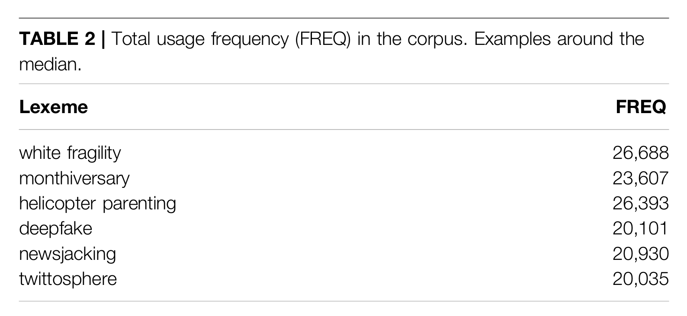

- theory: lexical innovation
	- conventionalization & diffusion
	  collapsed:: true
		- [[EC-Model]]
		  collapsed:: true
			- {{embed ((6447aec5-f6ed-4fc0-99e4-23a9d1ea761f))}}
		- dynamics of diffusion over time
		  collapsed:: true
			- {{embed ((6447af61-6674-4374-9bab-a132f1af0f01))}}
		- pathways of diffusion
		  collapsed:: true
			- types of linguistic variation
			  collapsed:: true
				- 
			- types of diffusion
			  collapsed:: true
				- across speakers and communities
				- across text types
			- examples
			  collapsed:: true
				- 
	- using frequency as an indicator of conventionality
	  collapsed:: true
		- operationalization
		  collapsed:: true
			- [[corpus-as-input]] and [[corpus-as-output]]
			- [[entrenchment]] and [[conventionalization]]
		- frequency measures (examples from [[Wurschinger2021SocialNetworks]])
		  collapsed:: true
			- raw frequency
			  collapsed:: true
				- most frequent
				  collapsed:: true
					- 
				- around the median
				  collapsed:: true
					- 
				- least frequent
				  collapsed:: true
					- 
				- case study selection
				  collapsed:: true
					- 
			- cumulative frequency
			  collapsed:: true
				- 
			- frequency over time
			  collapsed:: true
				- raw frequency
				  collapsed:: true
					- 
				- relative frequency
				  collapsed:: true
					- 
					  collapsed:: true
						- frequency of *blockchain* over time (text type `year`) in the [[JSI web corpus]]
						- [[Sketch Engine]] documentation ([link](https://www.sketchengine.eu/my_keywords/relative-text-type-frequency/))
						  collapsed:: true
							- Relative  text type  frequency compares the frequency in a specific text type to the frequency in the whole  corpus.
							- It shows how typical the word(s) is of a specific text type, e.g. of 
							  the spoken part of the corpus or of a particular website where the texts
							   were downloaded from.
							- The number is the relative frequency of the  query  result divided by the relative size of the particular text type. It can be interpreted as *how much more/less frequent is the result of the query in this text type compared to the whole corpus*.
						- another popular measure: *frequency per million words* (pmw)
			- frequency across communities
			  collapsed:: true
				- 
			- frequency across text types
			  collapsed:: true
				- distribution of the use of *blockchain* across topics in the [[enTenTen20]] corpus on [[Sketch Engine]]
				  collapsed:: true
					- 
- practice: studying lexical innovation using corpora
  collapsed:: true
	- using the case study words from [[Wurschinger2021SocialNetworks]],
	  collapsed:: true
		- *upskill*
		- *hyperlocal*
		- *solopreneur*
		- *alt-right*
		- *alt-left*
		- *poppygate*
	- for each of these words,
		- in the [[JSI web corpus]], determine
			- it’s total frequency
			- it’s frequency over time: which was the `Year` it was used the most?
		- in the [[enTenTen20]] corpus, determine
			- in which `Topic` was it used the most?
		- take notes and compare your results
			- which words show highest/lowest degrees of conventionality?
			- for which words is there a discrepancy to the results on Twitter?
		- bonus: create charts in Excel