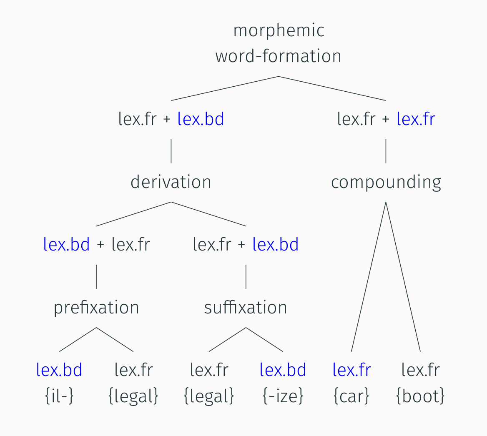

tags:: session

- diagram
	- {{renderer excalidraw, excalidraw-2023-05-16-10-41-35}}
- housekeeping
  collapsed:: true
	- solutions for last week’s exercises: see [here](((6450dc50-0db4-4ce1-a6e5-7440beb8e766)))
	- announcement: [[PAD Fremdsprachenassistenz]]
	  collapsed:: true
		- {{embed [[PAD Fremdsprachenassistenz]]}}
- # fundamentals in [[morphology and word-formation]]
	- [morphology]([[morphology]]) vs [word-formation]([[word-formation]])
	  collapsed:: true
		- 
			- [[Schmid2016EnglishMorphology]]: 15
	- overview of [word-formation]([[word-formation]]) processes
	  collapsed:: true
		- 
	- [morphemic word-formation]([[word-formation/morphemic]]) processes
	  collapsed:: true
		- 
	- [non-morphemic word-formation]([[word-formation/non-morphemic]]) processes
	  collapsed:: true
		- overview
		  collapsed:: true
			- {:height 213, :width 686}
		- characteristics
			- 
		- aspects of [[meaning]]
			- [[denotational]]: core meaning
			- [[connotational]]: associative (e.g. social, stylistic)
	- [[exercise]]: Analyze the word-formation processes involved in the following complex words.
	  collapsed:: true
		- *childhood*
		  collapsed:: true
			- derivation / suffixation
		- *paperback*
		  collapsed:: true
			- compounding / exocentric
		- *study-bedroom*
		  collapsed:: true
			- compounding / copulative
		- *foreigner*
		  collapsed:: true
			- derivation / suffication
		- *paleface*
		  collapsed:: true
			- compounding / exocentric
		- *Oxbridge*
		  collapsed:: true
			- blending
		- *CGEL*
		  collapsed:: true
			- initialism
		- *fridge*
		  collapsed:: true
			- clipping
- # a corpuslinguistic study of clipping: [[Hilpert2023Meaning]]
  collapsed:: true
	- ((645a1add-5577-41b5-a719-4379a3fc72d5))
	- ## abstract
	  collapsed:: true
		- {{embed ((645a1b9e-f78b-46c6-a43e-262f285a67d2))}}
	- ## theoretical framework
	  collapsed:: true
		- alternative view in previous work: no difference between source and clipped forms
		  collapsed:: true
			- ((645a1fda-7e5f-4fa4-8572-25f32477431e))
		- authors’ framework
			- [[Principle of No Synonymy]]
			  collapsed:: true
				- ((645a1ffc-fe23-483c-bb95-d1e5ca0548e3))
			- [[usage-based approach]]
			  collapsed:: true
				- ((645a2047-f5a9-4026-93bd-036c4a482c66))
			- [[distributional hypothesis]]
			  collapsed:: true
				- ((645a20e9-f7b0-478b-bd31-d1fa07fdd451))
				- ((645a20d0-6b75-486f-9ba9-bbdf716dc685))
	- ## data
	  collapsed:: true
		- dataset of clippings
		  collapsed:: true
			- ((645a2870-9ab6-4a81-941d-44fe6a3c121a))
		- corpus data
		  collapsed:: true
			- ((645a2087-0c80-4a30-838d-52a0d2c3e8fa))
	- ## method
	  collapsed:: true
		- analysing [[meaning]] based on
			- [[collocations]]
			- [[word embeddings]]
	- ## results
	  collapsed:: true
		- variation across text types
		  collapsed:: true
			- ((645a1dbd-328b-464e-b703-0ef2c6ab114f))
			- {{embed ((645a2a9e-c7a6-4959-801f-dea28d63998f))}}
		- semantic differences
			- {{embed ((645a2b02-c578-4edc-b121-f5bca5a76389))}}
- # [[exercise]]: studying [clipping]([[clipping]])
	- using [[Sketch Engine]]
		- for the dataset of clippings from [[Hilpert2023Meaning]]
			- 
			  id:: 645a24aa-aa0c-4e46-87c3-3afc287b2a9a
		- for example pairs of (1) source words (e.g. *brother*) and (2) clipped form (e.g. *bro*)
			- determine their [[frequency]]
				- total frequency in the [[Timestamped JSI web corpus 2014-2021 English]]
					- determine frequency for
						- absolute
						- relative
					- enter information into the [[Google Sheet]] [here](https://docs.google.com/spreadsheets/d/1G5CQR6ztojJe3XuqFtfKP_oD_tvc5Yi-kxPNpay2LNw/edit?usp=sharing);
						- short URL: https://shorturl.at/aguMS
				- frequency over time in the [[Timestamped JSI web corpus 2014-2021 English]]
				- frequency by text type in the [[enTenTen20]] corpus
			- studying [[semantics]] in the [[enTenTen20]] corpus
				- using [[collocations]]
				- using [[word sketches]]
				  collapsed:: true
					- for single forms (e.g. *bro*)
					- for comparing source words (e.g. *brother*) with clipped form (e.g. *bro*)
				- take notes for your target lexemes in the [[Google Sheet]] [here](https://docs.google.com/document/d/1CGxqohsOlfiJp8AWaePwUC-xYvDr6Cscf1Q1Mi-uwuI/edit?usp=sharing)
					- short URL: https://shorturl.at/nuBM9
	- follow-up: studying long-term [[diachronic]] trends using [[english-corpora.org]]
	  collapsed:: true
		- [[NOW]] corpus
		- [[COCA]]