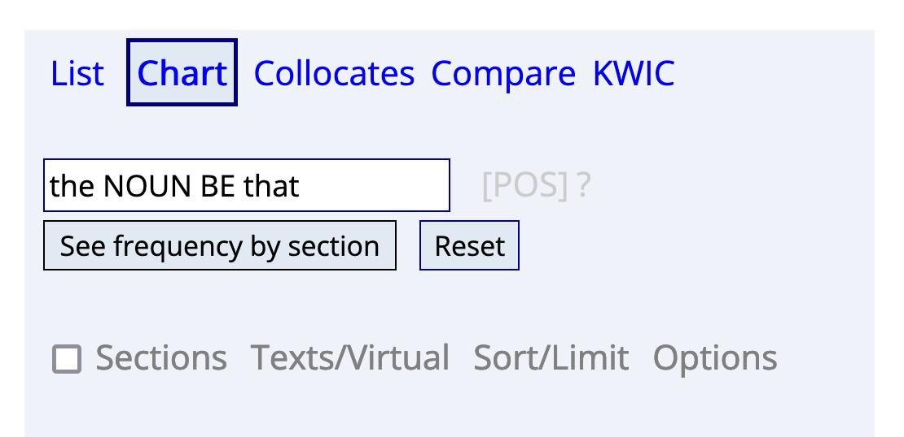

- # morphology
	- ## frequency-based analysis of clippings
		- {{embed ((645a1b1f-99b5-43c5-be5a-23f355169129))}}
	- ## studying [[semantics]] in the [[enTenTen20]] corpus
	  id:: 1e44dc00-0557-4672-9187-6986cf52b3e7
		- using [[collocations]]
			- theoretical background
				- ((f67743f8-3c70-475b-993b-1f2eb4bc9a2f))
				- {{embed ((643e7a15-ed51-442c-876c-b0e501e8a7c1))}}
				- ((6447a7c9-0293-435b-8944-d989642d2fe4))
				- {{embed ((645a2b02-c578-4edc-b121-f5bca5a76389))}}
			- using collocations in [[Sketch Engine]]
				- see ((61964467-2068-4ed7-bf8c-a0f00fa5293e))
		- using [[word sketches]]
			- see ((61964467-2068-4ed7-bf8c-a0f00fa5293e))
			- for single forms (e.g. *bro*)
			- for comparing source words (e.g. *brother*) with clipped form (e.g. *bro*)
		- take notes for your target lexemes in the [[Google Sheet]] [here](https://docs.google.com/document/d/1CGxqohsOlfiJp8AWaePwUC-xYvDr6Cscf1Q1Mi-uwuI/edit?usp=sharing) (short URL: https://shorturl.at/nuBM9)
- # syntax
	- studying syntactical constructions: [[Schmid2015Entrenchment]]
	- see ((61964467-2068-4ed7-bf8c-a0f00fa5293e))
- # using [[english-corpora.org]]
	- based on the syntactic study in [[Schmid2015Entrenchment]]: `the NOUN BE that` (e.g. *the thing is that*)
		- using [[COHA]]: https://www.english-corpora.org/coha/
			- forms and strings
				- {:height 270, :width 433}
				- 
			- [[frequency]]
				- over time ([[diachronic]])
					- 
					- 
				- across [[text types]] : using [[COCA]]
					- 
			- [[collocations]]
	- studying semantic features of clippings ([[Hilpert2023Meaning]])
		- [[collocations]]
			- 
			- 