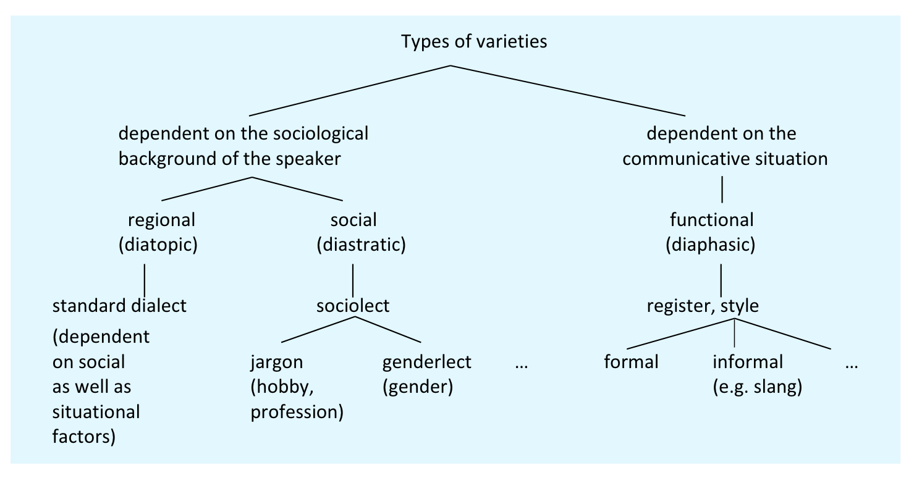
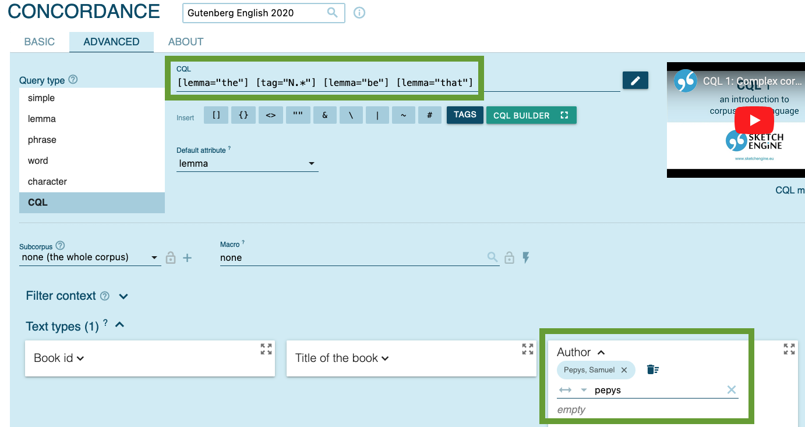
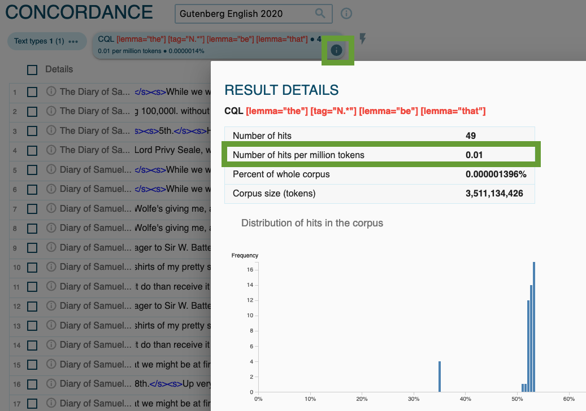
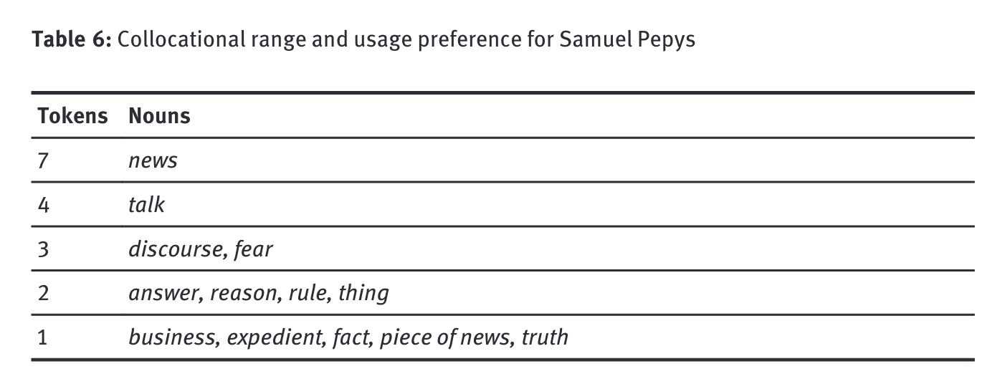

- [[assessment]] deadlines
  collapsed:: true
	- Hausarbeit
		- 18.09.2023
	- Thesenpapier
		- 07.09.2023
- linguistic variation
  collapsed:: true
	- types of [[linguistic variation]] and [[varieties]]
	  id:: 647ee07c-6f9e-40df-9e07-da25830ac199
	  collapsed:: true
		- 
			- [[Kortmann2020EnglishLinguistics]]: 204
	- variation between individual speakers
		- EC-Model
		  collapsed:: true
			- {{embed ((6447aec5-f6ed-4fc0-99e4-23a9d1ea761f))}}
		- [[entrenchment]]
			- {{embed ((646c7ffc-80c0-4526-935c-4c5f3d015114))}}
- [[Schmid2015Entrenchment]]: variation among historical author
  collapsed:: true
	- abstract
	  collapsed:: true
		- {{embed ((646c8707-eff6-415a-aeef-ecde49f26c76))}}
	- construction
	  collapsed:: true
		- corpus attestation
		  collapsed:: true
			- {{embed ((646c88e8-8923-4244-8457-d4791a56e7a0))}}
		- ((646c898a-23b1-46e0-82ea-39c4e1ca833e))
	- EC-Model
	  collapsed:: true
		- {{embed ((647f0619-8bfb-42b3-b4af-607eb44184b2))}}
	- data
	  collapsed:: true
		- {{embed ((646c887b-81fc-4b73-b8a9-5ace5e7b9ece))}}
		- corpora available in [[Sketch Engine]]
			- [[Gutenberg English 2020]]
			- [[English Historical Book Collection (EEBO, ECCO, Evans)]]
	- results
	  collapsed:: true
		- frequency over time
		  collapsed:: true
			- {{embed ((646c8a0c-c206-4b08-b7e3-30428f0f3596))}}
		- distribution across text types
		  collapsed:: true
			- {{embed ((647f06ba-5e13-4ba5-924d-4f73fdc7655f))}}
		- individual differences
		  collapsed:: true
			- {{embed ((647f0734-ac35-4b68-bf52-0cc558e7b4cc))}}
			- {{embed ((647f073d-ed74-4752-9930-0c3aedd92107))}}
		- semantic/functional change
		  collapsed:: true
			- {{embed ((646c9bdd-a595-46b1-a2c5-58d66fcb592b))}}
- [[practice]]
	- building on [[06 Syntax]]
		- {{embed ((646c8de9-6e1a-4e34-a604-12ad00520bf6))}}
	- compare the use of the construction between authors
		- corpus: [[Gutenberg English 2020]]
		- authors
		  id:: 647f139f-fefe-4c6d-90bf-90f5b2a1c5ff
			- [[Edmund Burke]]
			- [[Samuel Pepys]]
			- [[Samuel Richardson]]
			- [[Charlotte Brontë]]
		- frequency of the construction: [relative frequency]([[frequency/relative]]) (pmw: per million words)
			- [[Sketch Engine]] analysis
				- for [[Samuel Pepys]]
					- 
					- 
			- [[Microsoft Excel]] analysis
				- gather data for all authors (see [here](((647f139f-fefe-4c6d-90bf-90f5b2a1c5ff))))
				- make a table
				- make bar charts
					- for [absolute frequency]([[frequency/absolute]]): `Number of hits`
					- for [relative frequency (pmw)]([[frequency/relative]]): `Number of hits per million tokens`
		- semantic variation: do these authors show semantic/functional differences in their use of the construction? → nouns within the construction (e.g. *thing* in *the thing is that*): see [here](((646c8ab7-3d11-43d3-89d7-00d7944ebe60)))
			- for [[Samuel Pepys]]
				- 
				- results by [[Schmid2015Entrenchment]]
					- 
						- p. 610
			- investigate corpus attestations to get a sense of the semantic differences
			- take notes summarising the observed differences
	- further study: [[diachronic]] change
		- Does the semantic profile of the construction change over time (when analysed across all authors)?
		- How has this change evolved in later stages – more recent corpora like [[COHA]]?
		-
- notes
  collapsed:: true
	- {{renderer excalidraw, excalidraw-2023-06-06-14-35-12}}