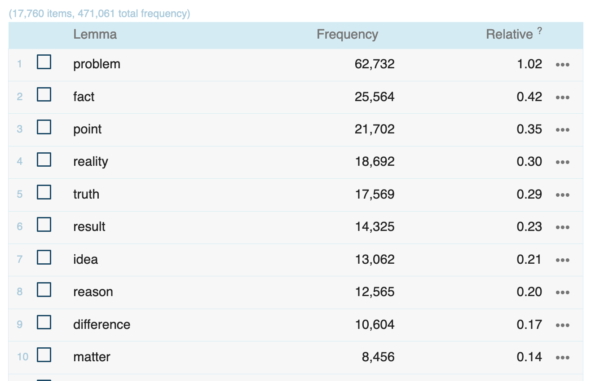
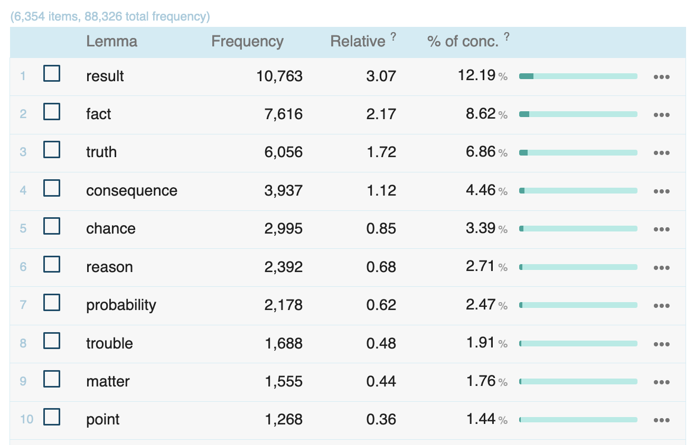
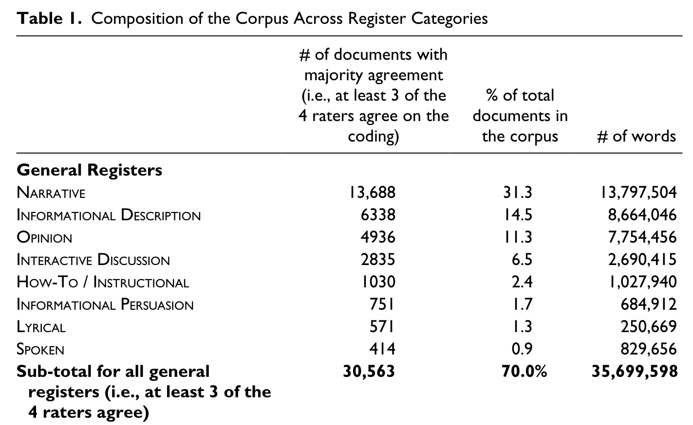
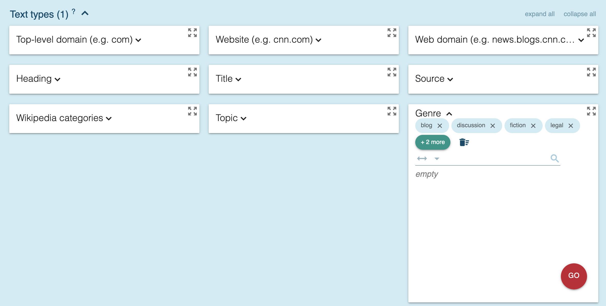
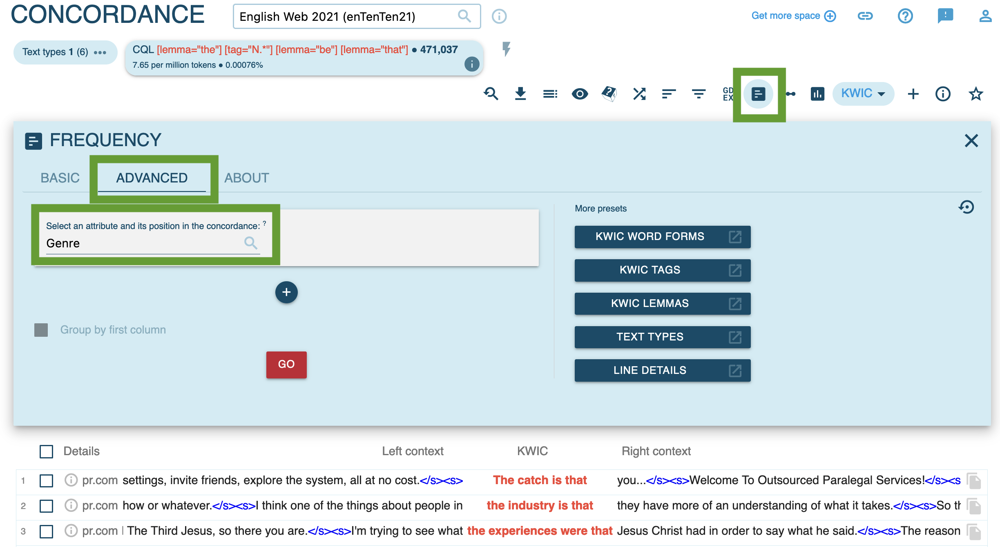
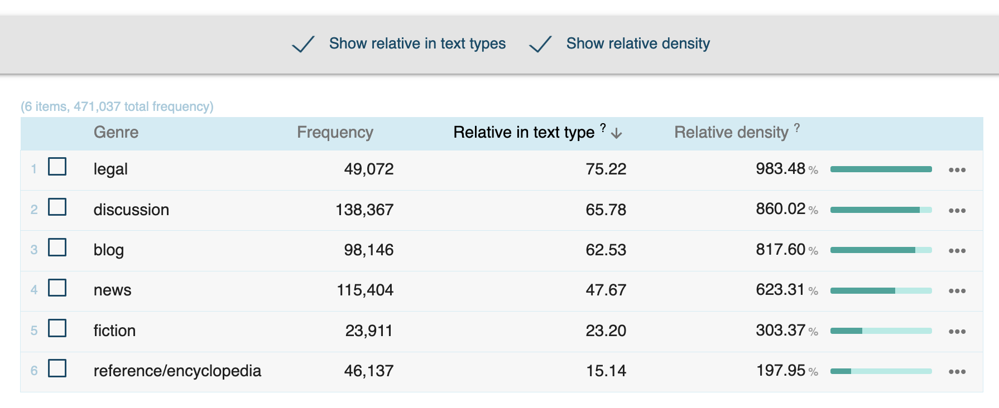

- # interindividual variation
  collapsed:: true
	- {{embed ((647f42de-e921-4037-85e9-7d51779e71de))}}
- # `the N BE that` in Present-Day English (PDE)
  collapsed:: true
	- What are the most frequent nouns in PDE? ([[enTenTen21]] corpus)
		- 
	- How does the construction differ compared to its earlier use in the [[Gutenberg English 2020]] corpus?
		- 
- # text type variation in the use of `the N BE that`
  collapsed:: true
	- {{embed ((647ee07c-6f9e-40df-9e07-da25830ac199))}}
	- [[theoretical framework]]
		- [[Schmid2015Entrenchment]]: historical text type variation
			- ((647f06ba-5e13-4ba5-924d-4f73fdc7655f))
			- collapsed:: true
			  > As far as text types are concerned, we have only investigated the data from those sources whose extent – in numbers of words – we could identify with sufficient reliability for calculating normalized frequencies of occurrence. This part of the data yielded the relative frequencies rendered in Figure 6. The ‘personal’ genres biography, letter, and diary reach higher relative scores than essays and chronicles, followed by prose fiction (novel, romance, satire) and more formally restricted forms of literary writing (drama, poem). Overall, less formal
				- p. 599
			- collapsed:: true
			  > genres seem to provide a better habitat for the construction to thrive in than more formal ones. Given notorious problems with genre classifications across centuries, and given the influence of other variables such as topic, style, and of course time, the reliability of these findings should not be overestimated, however.
				- p. 601
		- [[Biber2016Register]]: text type variation in [[web corpora]]
			- > Most previous linguistic investigations of the web have focused on special linguistic features associated with Internet language (e.g., the use of emoticons, abbreviations, contractions, and acronyms) and the “new” Internet registers that are especially salient to observers (e.g., blogs, Internet forums, instant messages, tweets).
			- > MultiDimensional (MD) analysis has also been used to analyze Internet registers, focusing on core grammatical features (e.g., nouns, verbs, prepositional phrases). MD research differs theoretically and methodologically from most other research approaches in linguistics in that it is built on the notion of linguistic co-occurrence, with the claim that register differences are best described in terms of sets of co-occurring linguistic features that have a functional underpinning.
			- > At the same time, though, most previous MD studies are similar to other previous research in their focus on new Internet registers, such as blogs, Facebook/Twitter posts, and email messages. These are the registers that we immediately think of in association with the Internet, and thus it makes sense that they should be the focus of most previous research.
			- > However, that emphasis means that we know surprisingly little at present about the full range of registers found on the web and the patterns of linguistic variation among those registers. This is the goal of the present study. Rather than beginning with a focus on new registers that are assumed to be interesting, we analyze a representative sample of the entire searchable web.
			- > End-users coded the situational and communicative characteristics of each document in our corpus, leading to a much wider range of register categories than that used in any previous linguistic study: eight general categories; several hybrid register categories; and twenty-seven specific register categories. This approach thus leads to a much more inclusive and diverse sample of web registers than that found in any previous study of English Internet language.
			- > The goal of the present study is to document the patterns of linguistic variation among those registers. Using MD analysis, we explore the dimensions of linguistic variation on the searchable web, and the similarities and differences among web registers with respect to those dimensions.
			- 
			  id:: 6488482e-0fd9-49cd-b1b4-56aadf272178
			  collapsed:: true
				- p. 101
	- [[practice]]: in the [[enTenTen21]] corpus …
		- In which text types is the construction most frequently used?
			- query for the construction
				- use the [[CQL]] query: `[lemma="the"] [tag="N.*"] [lemma="be"] [lemma="that"]`
				- and limit your search to the following `Genre` text types: `blog`, `discussion`, `fiction`, `legal`, `news`, `reference/encyclopedia`.
				  collapsed:: true
					- 
			- get the frequency per text type
				- 
				- 
		- How does the use of the construction differ between the text types `legal`, `discussion`, and `fiction` from a semantic/pragmatic perspective?
			- What are common and typical contexts and corpus attestations for each text type?
			- What are the most prominent nouns in the construction for each text type?
			- How would you describe and explain the variation between text types? What causes speakers to use the construction differently depending on text type at hand? (see [Biber’s framework](((6488482e-0fd9-49cd-b1b4-56aadf272178))))