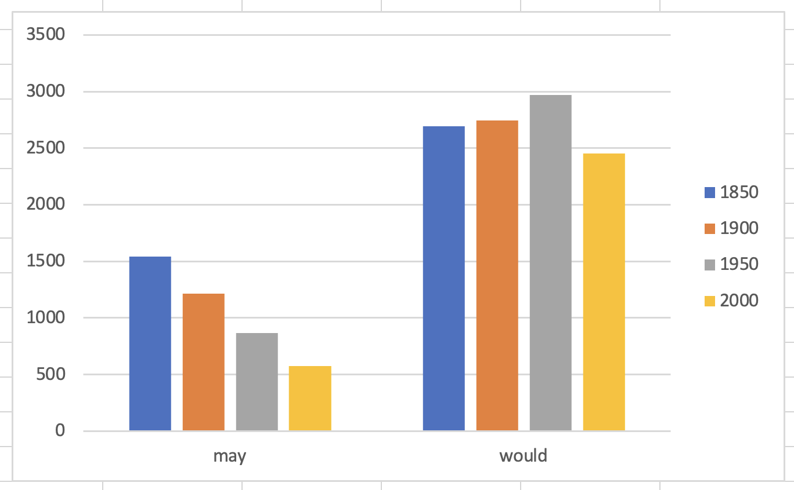
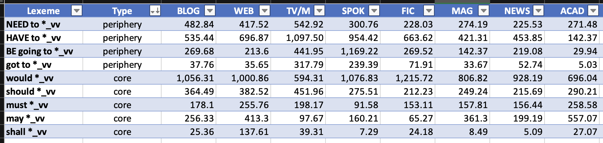

- {{embed ((64917fe0-a4ce-4950-b143-095414e022e3))}}
- {{embed ((64917fe7-8500-4261-99bc-f50ff0d481d4))}}
- # Language change among modal verbs ([[Hilpert2015Grammatical]])
	- ## theory
		- ((649abd0a-2934-4eca-96f8-8ff4f85e03e3))
		- Modal verbs in English
		  id:: 649ac78b-2cb0-4686-9390-52cd05c08ecf
			- core modal verbs
				- will
				- would
				- can
				- could
				- may
				- might
				- shall
				- should
				- must
			- peripheral modal verbs
				- BE going to
				- have to
				- got to
				- need to
		- modals with changes in frequency over time
			- decreases
				- ((649abd74-682e-4c07-b388-6ccbafd6fb97))
				- ((649abd8e-4b68-46ff-8a69-b11f268aa2cf))
				- candidates (see [source](((649b01d8-55ec-4a2b-9455-ac178224b327))))
					- would
					- may
					- should
					- must
					- shall
			- increases ([source](((649abe39-2aaf-438b-89e0-298a7e3eadcb))))
				- BE going to
				- have to
				- got to
				- need to
		- interaction between frequency changes and causes
			- ((649abda8-5bb7-4afb-a445-0a64c24a9b54))
		- potential cause: text-type variation
			- ((649abee4-15ed-4e99-854e-92a81a090ec8))
	- ## [[practice]]
		- collaborative [[Microsoft Excel]] spreadsheet: https://1drv.ms/x/s!AvkgNVl9yS6aoH3H5Epize61oTeZ
		- studying the rise and fall of modal verbs in the [[COHA]]
			- for each of the following modal verbs
				- {{embed ((649ac78b-2cb0-4686-9390-52cd05c08ecf))}}
			- determine their absolute and relative frequencies in the decades
				- 1850
				- 1900
				- 1950
				- 2000
				- 
			- create bar charts that show
				- whether these individual words show frequency changes over time
					- 
				- whether the groups of (1) core and (2) peripheral modal verbs show frequency changes on aggregate
		- Investigating whether those modals that exhibit the highest changes in frequency show (changes in) preferences for specific text types using the [[COCA]]
			- 
- further reading
	- case studies on how to use corpus linguistics to study language change
		- [[Biber2015Cambridge]]
		- [[Stefanowitsch2020Corpus]]