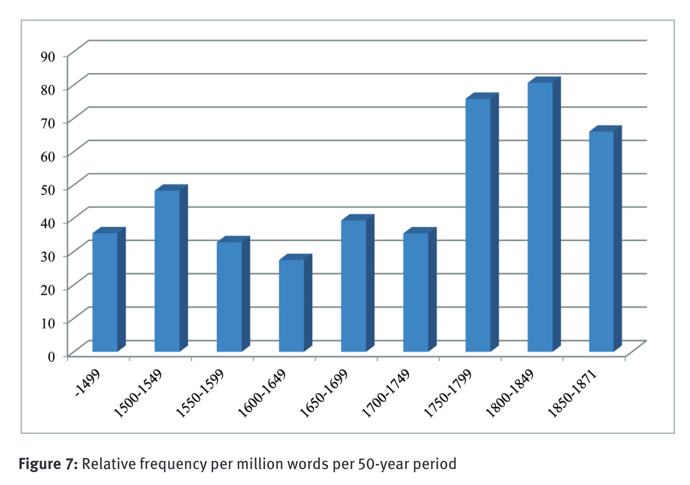

- [[bibliography]]
	- Schmid, Hans-Jörg, and Annette Mantlik. 2015. ‘Entrenchment in Historical Corpora? Reconstructing Dead Authors’ Minds from Their Usage Profiles’. *Anglia (Halle an Der Saale, Germany)* 133 (4): 583—623.
- [[pdf]]: [Schmid2015EntrenchmentHistorical.pdf](../assets/Schmid2015EntrenchmentHistorical_1684829585604_0.pdf)
- [[abstract]]
	- id:: 646c8707-eff6-415a-aeef-ecde49f26c76
	  > “Data from eight historical corpora spanning the period between 1250 and 1871 are investigated with regard to occurrences of the ‘N+BE+that-construction’ (as in my concern is that [...], the idea was that [...]). The formal, semantic, and pragmatic changes of this construction are described on the basis of 1,588 attestations retrieved from the corpora. Following this, the usage profiles of individual authors are examined. It is shown that even authors who are comparable in terms of period and genre show significant differences with regard to the frequency of use of the construction, collocational ranges and preferences, the use of semi-fixed lexical expressions manifesting the construction, as well as their functional preferences. These differences are interpreted from the perspective of the so-called ‘Entrenchment-and-Conventionalization Model’ (Schmid 2014a and 2015). It is argued that the usage profiles of individual authors can provide insights into the ways in which the construction under investigation was represented in these authors’ minds, and that the observable collective long-term changes arise from the interaction of the cognitive processes in individual minds and the social processes taking place in the speech community.” (Schmid and Mantlik, 2015, p. 583)
- the construction: `the N BE that`
	- examples
		- > (as in my concern is that [...], the idea was that [...])
			- taken from [abstract](((646c8707-eff6-415a-aeef-ecde49f26c76)))
	- corpus attestation
		- 
			- p. 586
	- analysis in terms of [[Construction Grammar]]
		- 
			- p. 586
- [[data]]
	- 
		- p. 591
- results
	- [[diachronic]] [[frequency]]
		- 
			- p. 601